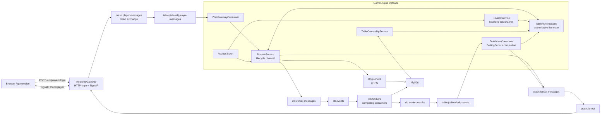
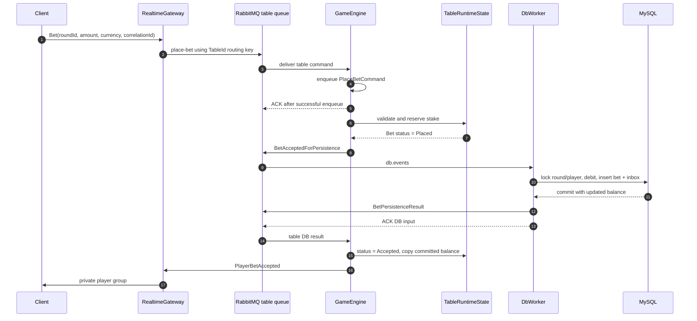

# CrashPlatform

CrashPlatform is an event-driven backend for a multi-table Crash game. It is
organized around an in-memory `GameEngine`, RabbitMQ transport boundaries,
MySQL persistence, a gRPC RNG service, and a SignalR gateway.

> **Engineering status:** active development. This document describes the
> current source as of 2026-07-23. A flow marked **Partial** works on its main
> path but still has production-readiness work listed under **Next / TODO**.

## Contents

- [System architecture](#system-architecture)
- [Project responsibilities](#project-responsibilities)
- [Architecture invariants](#architecture-invariants)
- [Flow status](#flow-status)
- [Request and process flows](#request-and-process-flows)
- [Message and queue catalogue](#message-and-queue-catalogue)
- [Run locally](#run-locally)
- [Testing](#testing)
- [Prioritized roadmap](#prioritized-roadmap)

## System architecture



The current persistence model is hybrid:

- Table and round ownership, round creation, and round status transitions are
  written directly by `GameEngine`.
- Bet acceptance, cancellation, cash-out, loss settlement, and player balance
  changes are persisted asynchronously by `DbWorkers`.
- RNG records are owned and stored directly by `RngService`.

## Project responsibilities

| Project | Current responsibility |
| --- | --- |
| `Crash.Domain` | Entities, enums, options, and synchronized in-memory table/round/player state. |
| `Crash.Contracts` | RabbitMQ integration contracts grouped by transport direction: gateway-to-engine, engine-to-gateway, and DB-worker messages/results. |
| `Crash.Persistence` | EF Core `DataContext`, repositories, migrations, the DB-worker inbox, and database logging support. |
| `RealtimeGateway` | Player login, table allocation, JWT generation/validation, SignalR groups, command publishing, and client-event delivery. |
| `GameEngine` | Table ownership, per-table runtime state, round lifecycle, bet decisions, cash-out decisions, and integration-event publishing. |
| `DbWorkers` | Idempotent financial persistence for accepted, cancelled, and settled bets. |
| `RngService` | Idempotent provably-fair entropy and crash-point generation over gRPC. |
| `client.html` | Lightweight local browser client for login, round events, betting, and cash-out. |
| `load-tests/signalr` | End-to-end SignalR connection and bet-acceptance latency test. |

## Architecture invariants

### Authority boundaries

- The JWT-authenticated connection is authoritative for `PlayerId` and
  `TableId`; client payloads cannot select another player.
- `TableRuntimeState` is authoritative for live round state, current
  multiplier, connected runtime players, reserved balances, and in-flight bets.
- MySQL is authoritative after a financial DB-worker transaction commits. The
  committed balance returned by the worker replaces the corresponding runtime
  balance.
- `RngService` owns the generated entropy, server-seed commitment, algorithm
  version, and crash point for a `(TableId, RoundId)` pair.

### Partitioning and ownership

- `TableId` is the routing and ownership boundary.
- A `GameEngine` instance owns a table through a MySQL lease identified by
  `OwnerId` and a monotonically increasing `FencingToken`.
- Player commands use durable per-table queues:
  `table.{tableId}.player-messages`.
- A round copies the table owner and fencing token when it is created. The
  current code does not run a separate round-lease acquisition/renewal loop.
- Dangerous round and bet writes compare the persisted round/table identity and
  fencing token so an old table owner cannot commit new financial state.

### Ordering, idempotency, and delivery

- The player request `CorrelationId` becomes the public `BetId`.
- A DB-worker envelope has a separate `MessageId`. It is stored in
  `ProcessedDbMessages` in the same transaction as the business write.
- Bet persistence uses a sequence: acceptance is currently sequence `1`;
  cancellation and settlement are sequence `2`.
- Player-command messages are ACKed by `GameEngine` after successful dispatch
  into its in-memory command channel. That is an intentional ownership handoff,
  not proof of database persistence.
- DB-worker input is ACKed only after commit/idempotent duplicate handling and
  after the result publish call returns.
- RabbitMQ uses at-least-once delivery in several paths, so consumers must
  tolerate redelivery. SignalR notification delivery is currently live and
  best-effort; reconnect replay still needs to be implemented.
- DB-worker results bypass the two `RoundsService` channels and call the
  settlement-completion handler from the RabbitMQ consumer callback. Runtime
  state is locked, but cross-source per-table command ordering is not yet
  guaranteed.

### Financial state names

- `Placed`: reserved in engine memory; DB acceptance is pending.
- `Accepted`: the DB worker committed the debit and bet row.
- `CashedOut`: the DB worker committed the payout and final bet state.
- `Lost`: the DB worker committed a zero-payout terminal state.
- `Canceled`: an unconfirmed bet was removed before round start and its stake
  was returned.

## Flow status

| Flow | Status | Main owner |
| --- | --- | --- |
| Player login and table allocation | Implemented | `RealtimeGateway` |
| JWT SignalR connection and player join | Implemented | `RealtimeGateway` + `GameEngine` |
| Player disconnect / leave | Partial | `RealtimeGateway` |
| Dynamic table ownership and command-consumer reconciliation | Partial | `GameEngine` |
| Round creation and RNG allocation | Partial | `GameEngine` + `RngService` |
| Time-based multiplier ticks | Implemented | `GameEngine` |
| Place bet and DB acceptance result | Partial | Gateway + Engine + DB worker |
| Unpersisted bet cancellation before start | Partial | Engine + DB worker |
| Manual cash-out | Partial | Engine + DB worker |
| Auto cash-out | Partial | Engine + DB worker |
| Crash and losing-bet settlement | Partial | Engine + DB worker |
| Engine-to-client realtime fanout | Partial | Engine + Gateway |
| DB-worker inbox/idempotent persistence | Implemented | `DbWorkers` |
| Reconnect/current-state snapshot | Planned | Engine + Gateway |
| SignalR bet load test | Implemented | `load-tests/signalr` |

## Request and process flows

### 1. Player login and table allocation

**Entry point:** `POST /api/players/login`

**Current approach**

1. `AuthController` normalizes the username.
2. `PlayerRepository` loads the player or creates a local `FUN` player with a
   development balance.
3. `TableRepository.GetOrCreateTableForPlayer` keeps an existing table
   assignment when possible.
4. A MySQL advisory lock serializes new table allocation across gateway
   instances.
5. The allocator fills an existing table up to 200 players or creates a new
   table.
6. The gateway returns the player, a six-hour JWT, and the SignalR hub URL.

**Architecture notes**

- Re-login is idempotent at the table-assignment level.
- MySQL `GET_LOCK` is deliberately used because a normal read-then-insert flow
  can over-create tables during concurrent login bursts.
- JWT claims carry `playerId`, `externalId`, `type`, and `tableId`.

**Next / TODO**

- Replace username-only development login with the operator/RGS authentication
  contract.
- Enforce a unique database index on player external identity and make
  concurrent player creation idempotent.
- Move balances to a wallet/ledger boundary; the current player row is a local
  single-currency model.
- Add table status, jurisdiction/currency/operator compatibility, and a real
  seat-release flow. `PlayersCount` is incremented but not currently decremented.
- Make the table capacity configurable instead of hard-coded to 200.

### 2. SignalR connect and player join

**Entry point:** `GET /hubs/player` with an access token.

**Current approach**

1. `JwtConnectionValidator` reads `access_token` or a Bearer token and validates
   the signature and expiry.
2. `PlayerHub` stores the claims-derived identity in the connection context.
3. The connection joins the table group and the private
   `player:{playerId}` group.
4. The hub publishes a durable `player-joined` message to the table queue.
5. The owning engine maps it to `AddPlayerToTableCommand` and ACKs the broker
   delivery after the command is enqueued.
6. `RoundsService` loads the player from MySQL and adds a runtime player.
7. If the table has no current round, the join starts round creation. Otherwise
   the engine publishes the current round as `NewRoundInfo`.

**Architecture notes**

- Player identity is never trusted from a WebSocket request body.
- Table groups receive public lifecycle events. Private player groups receive
  balances, bet decisions, cash-out results, and future player snapshots.
- A player disconnect does not cancel an already accepted bet.

**Next / TODO**

- Publish and process `player-left`; the current disconnect path removes
  SignalR group membership only.
- Remove inactive players from `TableRuntimeState` without removing their
  accepted bets.
- Publish a private `CurrentState` snapshot on join/reconnect instead of
  rebroadcasting `NewRoundInfo` to the entire table.
- Add connection/session deduplication for multiple tabs and reconnects.
- Replace permissive CORS, embedded development signing keys, and disabled
  issuer/audience checks before production use.

### 3. Table ownership and consumer reconciliation

**Process:** `TableOwnershipService`

**Current approach**

1. The engine registers or loads an `Owner` row by `GameEngine:EngineId`.
2. Every 15 seconds it renews every locally owned table using
   `(TableId, OwnerId, FencingToken)` while the lease is still valid.
3. Failed renewal removes the table from `GameEngineOptions.Tables`.
4. The engine tries to acquire one unowned/expired table per refresh cycle.
5. Acquisition atomically sets the owner, extends the lease, and increments the
   fencing token.
6. A new `TableRuntimeState` is added to the local table registry.
7. `WssGatewayConsumer` reconciles that registry every second, starting or
   cancelling the RabbitMQ consumer for each table queue.
8. An in-flight command received after ownership loss is NACKed and requeued for
   the new owner.

**Architecture notes**

- Initial acquisition currently grants a 60-second lease; renewal extends it by
  40 seconds.
- Renewal does not increment the fencing token. Only a new acquisition does.
- EF `ExecuteUpdateAsync` is followed by `AsNoTracking` so the engine reads the
  newly committed token rather than a stale tracked entity.
- Table ownership is live and dynamic; it is not a startup-only table list.

**Next / TODO**

- Track the locally confirmed `LeaseExpiresAt` and stop processing immediately
  when it passes, even if MySQL renewal calls keep failing.
- Reconcile and cancel `table.{tableId}.db-results` consumers on ownership loss.
  The current DB-result consumer only adds consumers and never removes them.
- Restore active round, players, accepted bets, pending settlements, and tick
  sequence when a new engine acquires a table.
- Implement graceful `ReleaseOwnership`; the repository method is currently
  not implemented.
- Acquire until the instance reaches a configured table capacity instead of one
  table every 15 seconds.
- Enforce unique engine identity and handle concurrent owner registration.
- Either implement an independent round lease or remove misleading round-lease
  fields and document that the round only snapshots the table fence.

### 4. Round creation and RNG generation

**Triggers:** first player joins an empty owned table, or the post-crash delay
finishes.

**Current approach**

1. `RoundRepository.CreateRoundAsync` opens a DB transaction, verifies the
   table fencing token, consumes/increments `Table.NextNonce`, and creates a
   `Pending` round scheduled six seconds in the future.
2. `GameEngine` calls `RngService.GenerateRoundEntropy` with table ID, round ID,
   client seed, and nonce.
3. `RngService` generates a random 32-byte server seed.
4. It stores the SHA-256 commitment, encrypts the original seed with AES-GCM,
   derives entropy with `HMACSHA256(serverSeed, clientSeed:nonce)`, and calculates
   a 96% RTP inverse-curve crash point rounded down to two decimals.
5. `(TableId, RoundId)` is unique. A retry returns the original stored RNG row
   instead of generating another outcome.
6. The engine writes RNG ID/crash point to the round, changes it to `Betting`,
   creates the in-memory round, and publishes `NewRoundInfo`.

**Architecture notes**

- The crash point remains inside server-side runtime state and is not included
  in client round notifications before the crash.
- RNG records include `rng_algorithm_version` so historical verification can
  retain the original algorithm.
- RNG storage currently uses its own startup schema initialization rather than
  the EF migration pipeline.

**Next / TODO**

- Replace the fixed `"client-seed-todo"` value with a defined operator/player
  seed policy.
- Add server-seed reveal after settlement and a public/offline verification
  procedure.
- Move encryption keys to a secret manager and define rotation/versioning.
- Guard the entropy update with table/round owner and fencing token; the current
  update filters only by round ID.
- Define retry/compensation when the RNG call or entropy update fails after the
  round row has been created.
- Move RNG schema evolution to controlled migrations for production.
- Add limits and validation for client-seed length and numeric crash-point
  bounds.

### 5. Round ticking

**Process:** `RoundsTicker`

**Current approach**

1. Every 50 ms the ticker evaluates every locally owned table.
2. `TableRuntimeState.TryAdvanceRound` derives the multiplier from elapsed
   server time using `e^(0.12 * elapsedSeconds)`.
3. The multiplier is floored to two decimals and never advanced above the
   private crash point.
4. Repeated identical two-decimal values are not emitted.
5. Auto-cash-out evaluation is queued for every changed multiplier.
6. Public ticks are throttled to at most one every 100 ms per table.
7. Tick commands use a bounded 1,024-item `DropOldest` channel.
8. On the first tick, the engine attempts to mark the round `Running` using the
   round/table/fencing token, then publishes `RoundTick`.
9. `RoundTick` is intentionally transient: it is non-persistent and does not
   wait for a broker confirm.

**Architecture notes**

- Elapsed time, not loop count, is authoritative. A delayed loop therefore does
  not slow or reshape the multiplier curve.
- `TickSequence` lets the gateway/client reject duplicate or out-of-order
  snapshots.
- Lifecycle commands and tick commands have separate readers and may execute
  concurrently against synchronized table state.

**Next / TODO**

- Check and act on the result of `MarkRunningAsync`.
- Guarantee per-table ordering across tick and lifecycle channels so a delayed
  tick cannot be published after a crash event.
- Partition processing per table so one slow table, broker call, or five-second
  lifecycle delay cannot affect other tables.
- Define overload behavior and metrics for dropped ticks, channel depth, ticker
  lag, and publish latency.
- Consider a timer wheel or per-table scheduler when the table count becomes
  large.

### 6. Place bet and acceptance

**Entry point:** SignalR method `Bet`.



**Current approach**

1. The gateway validates amount, round ID, currency, and auto-cash-out input.
2. A missing correlation ID is generated. The JWT supplies player/table
   identity.
3. `PlayerMessagePublisher` publishes `place-bet` to the durable table queue.
4. The owning engine maps the envelope to `PlaceBetCommand` and hands it to the
   lifecycle channel.
5. `BettingService` validates USD, current round, table presence, betting
   deadline, minimum stake, duplicate player bet, and runtime balance.
6. The stake is reserved in memory and the bet becomes `Placed`.
7. A `BetAccepted` DB-worker message is published with the table fencing token.
8. The worker locks the bet/player rows, validates the persisted round fence,
   debits the DB balance, inserts the bet, records the inbox message, and commits
   atomically.
9. The worker publishes a table-routed result.
10. The engine changes the runtime bet to `Accepted`, copies the committed DB
    balance, and publishes `PlayerBetAccepted` privately.
11. Validation failures publish `PlayerBetRejected` privately.

**Architecture notes**

- There are deliberately two acceptance stages: engine reservation (`Placed`)
  and committed financial acceptance (`Accepted`).
- The client receives acceptance only after the DB result on the normal path.
- One bet per player per round is enforced by the in-memory dictionary.
- `BetId` is unique in MySQL; DB-worker `MessageId` is separately unique in the
  inbox.

**Next / TODO**

- Add RabbitMQ publisher confirms/mandatory-return handling to gateway commands
  and DB-worker commands. A successful `BasicPublish` call alone is not broker
  durability.
- Make the lifecycle channel bounded and define explicit backpressure/rejection
  behavior before ACKing the player command.
- Make duplicate-correlation handling commit-aware. The current in-memory
  duplicate fast path can publish acceptance before the original DB result.
- Return a deterministic rejection for malformed player IDs and all unsupported
  states instead of logging/silently returning.
- Validate maximum stake, decimal precision, currency-specific limits,
  responsible-gaming limits, and operator limits.
- Add a durable recovery path for `Placed` bets if the engine stops after
  ACKing the player command but before DB persistence completes.

### 7. Unpersisted bet cancellation before round start

**Trigger:** the round enters its final second before `StartsAt`.

**Current approach**

1. The ticker finds bets still in `Placed` with `IsPersisted == false`.
2. It removes them from the runtime round and returns the reserved runtime
   stake.
3. It publishes `BetCancelled` to the DB worker.
4. The worker waits/retries if acceptance has not reached MySQL yet.
5. Once present, the worker locks the bet/player, validates the round fence,
   returns the stake, changes the bet to `Canceled`, and commits.
6. The engine consumes the cancellation result, copies the committed balance,
   and publishes a private `PlayerBetRejected` with code `BET_CANCELLED`.

**Architecture notes**

- This flow prevents a bet with unknown operator/DB acceptance from silently
  entering a running round.
- Acceptance and cancellation may be processed by different DB-worker replicas,
  so the cancellation path treats a missing accepted bet as transient.

**Next / TODO**

- Model this as an explicit acceptance deadline/state machine rather than a
  ticker-side race.
- Add bounded retry/backoff and an operational alert if acceptance does not
  become visible.
- Use stable causation IDs for cancellation and expose the final cancellation
  reason to support/audit tooling.
- Add race tests for acceptance result versus cancellation result ordering.

### 8. Manual and automatic cash-out

**Manual entry point:** SignalR method `CashOut`.

**Current approach**

- Manual cash-out:

  1. The gateway accepts `roundId`, `betId`, and optional correlation ID. It
     does not trust a client multiplier.
  2. The engine validates the current non-crashed round, matching accepted bet,
     and authoritative runtime multiplier.
  3. It calculates payout using the current runtime multiplier.

- Automatic cash-out:

  1. Each multiplier change queues `ProcessAutoCashoutsCommand`.
  2. The engine selects accepted bets whose configured target has been reached.
  3. It calculates payout using the configured target multiplier, not ticker
     overshoot.

- Shared settlement:

  1. An in-memory `_pendingSettlements` key prevents duplicate concurrent
     settlement publication for the same bet.
  2. The engine publishes `BetSettled` with status `CashedOut`, payout, P/L,
     sequence, and fencing token.
  3. The DB worker locks the bet and player, validates the round fence and state
     transition, credits the player, records the inbox entry, and commits.
  4. The result updates runtime state/balance and produces private
     `BetCashedOut`.

**Architecture notes**

- The engine decides whether/when a cash-out is valid; the DB worker validates
  identity, ordering, and ownership and commits the supplied outcome.
- Terminal duplicate events with the same result are idempotent. Conflicting
  terminal results are permanent investigation failures.

**Next / TODO**

- Publish explicit `CashOutRejected` results for invalid, late, duplicated, or
  stale requests. The current manual path can return silently.
- Define the exact business rule at the crash boundary. The current ticker
  queues auto-cash-out before crash handling on the crash tick.
- Persist pending settlement intent or rebuild it after restart; the current
  deduplication dictionary is process-local.
- Add per-bet optimistic versioning or a single ordered bet stream to make
  manual cash-out, auto cash-out, and crash loss mutually exclusive by design.
- Add settlement timeouts and player-visible pending/retry behavior.

### 9. Crash, losing bets, and next round

**Trigger:** elapsed multiplier reaches the private crash point.

**Current approach**

1. `TryAdvanceRound` atomically sets the runtime multiplier to the crash point,
   increments sequence, and marks the in-memory round crashed.
2. The ticker queues final auto-cash-out evaluation, then queues
   `CrashRoundCommand` on the same lifecycle channel.
3. The crash handler performs a fencing-token-guarded DB update to mark the
   round `Crashed`.
4. Every still-accepted runtime bet publishes a zero-payout `Lost` settlement
   to DB workers.
5. The engine publishes `RoundCrashed` to the table.
6. It waits five seconds and creates the next round.
7. Lost DB results mark the matching runtime bet `Lost`; no balance credit is
   applied.

**Architecture notes**

- Crash persistence must succeed before loss commands and the public crash
  event are sent.
- Publishing loss commands does not mean those settlements have committed; the
  result path completes them asynchronously.
- The client currently marks its active bet lost when the public crash event
  arrives.

**Next / TODO**

- Decide and test whether an auto-cash-out equal to the crash point loses or
  wins, then encode that policy in one atomic transition.
- Do not block the single lifecycle reader for every table during the
  five-second inter-round delay.
- Keep previous-round settlement state until every result is terminal. The
  current result handler requires the result round to still be the table's
  current round and can requeue a late result indefinitely after the next round
  replaces it.
- Transition rounds through `Settling` and `Settled` after all accepted bets
  reach terminal state.
- Publish a private lost-bet settlement event with final P/L and balance.
- Add crash/settlement recovery after ownership transfer or process restart.

### 10. DB-worker processing and result delivery

**Process:** `DbMessageConsumer` and `DbWorkerMessageProcessor`.

**Current approach**

1. All worker replicas compete on durable queue `db.events` with prefetch 10.
2. JSON/type validation happens before opening the processing scope.
3. The processor checks `ProcessedDbMessages`, starts a transaction, checks
   again, and applies one business transition.
4. Bet/player rows use `SELECT ... FOR UPDATE` for financial serialization.
5. The business write and inbox row commit in the same transaction.
6. A duplicate `MessageId` returns `AlreadyProcessed` and the current balance.
7. The worker publishes `BetPersistenceResult` to
   `table.{tableId}.db-results`.
8. The input is ACKed after the result publish call.
9. Invalid JSON/type pairs and permanent financial/ownership conflicts are
   rejected to `db.events.investigation`.
10. Other failures are NACKed and requeued as transient.

**Architecture notes**

- Scaling DB workers does not change fencing tokens. Fencing protects the
  engine's table/round ownership; the inbox, row locks, and state checks protect
  worker concurrency.
- The implementation treats a missing accepted bet or round as transient. A
  missing bet can be caused by concurrent workers; a persistently missing round
  indicates an ordering or recovery fault that needs an alert.
- The result contains a new `MessageId` plus the original
  `CausationMessageId`.

**Next / TODO**

- Use a transactional outbox for DB results, or at minimum publisher confirms.
  Currently the DB transaction can commit and the input can be ACKed without a
  durable guarantee that the result reached RabbitMQ.
- Provision each table result queue before accepting DB work, and publish
  results as mandatory. Today the engine declares the result queue dynamically,
  so an early result can be unroutable before that binding exists.
- Add retry count, exponential backoff, delayed queues, and a maximum retry
  policy; plain requeue can create a hot poison-message loop.
- Classify stale fencing-token events separately from corrupt financial events
  and retain a searchable audit record.
- Guarantee per-bet event ordering when several worker replicas process
  acceptance/cancellation/settlement concurrently.
- Add result-consumer deduplication and an inbox/outbox retention policy.
- Expose queue depth, redelivery count, transaction latency, duplicate rate,
  stale-event count, and investigation-queue alerts.

### 11. Engine-to-client realtime fanout

**Current approach**

1. `GameEngine` publishes all client events to the direct
   `crash.fanout-messages` exchange using routing key `ClientMessages`.
2. `RoundTick` uses a transient non-confirmed channel.
3. Lifecycle and financial events use persistent messages, mandatory publish,
   publisher confirms, and up to three connection-level attempts.
4. `RealtimeGateway.ClientMessagesConsumer` consumes `crash.fanout`.
5. Public round events are sent to the table group.
6. Bet decisions, balances, cash-out results, and state snapshots are sent to
   `player:{playerId}`.
7. The RabbitMQ delivery is ACKed after the SignalR `SendAsync` call succeeds.

**Architecture notes**

- Public events: `NewRoundInfo`, `RoundTick`, `RoundCrashed`.
- Private events: `PlayerBetAccepted`, `PlayerBetRejected`, `BetCashedOut`,
  `CurrentState`.
- Tick loss is acceptable because a later tick is a newer snapshot. Lifecycle
  and money-related notifications use the reliable publisher path.

**Next / TODO**

- Replace the single shared gateway queue before horizontally scaling the
  gateway. Competing gateway consumers would otherwise deliver an event only to
  clients connected to whichever gateway consumed it.
- Use a SignalR backplane or one queue per gateway instance with lifecycle
  registration and cleanup.
- Deduplicate reliable events at the gateway/client by `MessageId`.
- Handle unroutable mandatory publishes explicitly.
- Add replay/snapshot recovery for clients that miss lifecycle events.

### 12. Disconnect and reconnect

**Current approach**

- Login preserves the player's existing DB table assignment.
- SignalR automatic reconnect obtains the same token/identity while it remains
  valid.
- A new connection publishes `player-joined` again; adding an existing runtime
  player is idempotent.
- Disconnect removes the connection from table/private SignalR groups.
- `PlayerLeft` and `RoundStateSnapshot` contracts exist, and the gateway can
  deliver `CurrentState`, but the full engine flow is not wired.

**Next / TODO**

- Publish `player-left` on final disconnect with a grace period so short
  network interruptions do not churn presence.
- Track connection count per player before removing runtime presence.
- Add a request/response snapshot flow containing round sequence, active bet,
  committed balance, pending settlement, and server time.
- Support token refresh and re-authorize table assignment on long reconnects.

### 13. SignalR load-test flow

**Current approach**

1. The Node.js test creates players through the real login endpoint.
2. It opens authenticated SignalR connections with configurable concurrency.
3. Every player submits one bet for each future `NewRoundInfo`.
4. Latency starts immediately before `connection.invoke("Bet", ...)`.
5. It ends at the matching private `PlayerBetAccepted` or
   `PlayerBetRejected`, keyed by correlation/message ID.
6. Reports include connection counts, table distribution, timeouts, rejection
   codes, and acceptance average/p50/p95/p99/max.

See [load-tests/signalr/README.md](load-tests/signalr/README.md).

**Next / TODO**

- Add manual/auto cash-out latency and correctness scenarios.
- Add reconnect, ownership-transfer, RabbitMQ restart, DB slowdown, and duplicate
  delivery tests.
- Assert financial invariants after each run: balance conservation, one terminal
  outcome per accepted bet, and no unsettled completed rounds.
- Export machine-readable results for regression comparison.

## Message and queue catalogue

### RabbitMQ topology

| Purpose | Exchange | Queue | Routing key | Durability |
| --- | --- | --- | --- | --- |
| Player commands | `crash.player-messages` | `table.{tableId}.player-messages` | `{tableId}` | Durable/persistent |
| DB work | `db.worker-messages` | `db.events` | `DbWorkers` | Durable/persistent |
| DB investigation | `db.worker-messages.dead-letter` | `db.events.investigation` | `DbWorkers.Dead` | Durable/persistent |
| DB results | `db.worker-results` | `table.{tableId}.db-results` | `table.{tableId}` | Durable/persistent |
| Client fanout | `crash.fanout-messages` | `crash.fanout` | `ClientMessages` | Ticks transient; lifecycle/financial persistent |

Changing arguments on an existing durable RabbitMQ queue can cause
`PRECONDITION_FAILED`. For example, adding dead-letter arguments to an existing
`db.events` queue requires a deliberate migration: use a new queue, apply an
appropriate RabbitMQ policy, or delete/recreate the local queue only when its
messages are disposable.

### SignalR methods

| Method | Input | Current result |
| --- | --- | --- |
| `Bet` | Round ID, amount, currency, optional correlation ID and auto-cash-out target | Private `PlayerBetAccepted` or `PlayerBetRejected` |
| `CashOut` | Round ID, bet ID, optional correlation ID | Private `BetCashedOut`; invalid cases currently may be silent |

### Gateway-to-engine messages

| Wire `messageType` | Status |
| --- | --- |
| `player-joined` | Produced and processed |
| `place-bet` | Produced and processed |
| `cash-out` | Produced and processed |
| `player-left` | Contract/consumer branch exists; gateway does not currently produce it and engine does not remove the player |
| `player-balance` | Contract exists; not currently processed by the engine consumer |

### Engine-to-gateway events

| Wire `messageType` | Scope | Status |
| --- | --- | --- |
| `NewRoundInfo` | Table | Produced and delivered |
| `RoundTick` | Table | Produced and delivered |
| `RoundCrashed` | Table | Produced and delivered |
| `PlayerBetAccepted` | Player | Produced after DB acceptance |
| `PlayerBetRejected` | Player | Produced for bet rejection/cancellation |
| `BetCashedOut` | Player | Produced after DB settlement |
| `CurrentState` | Player | Contract and gateway delivery exist; engine production is not wired |

### DB-worker messages

| Input type | Result type | Business effect |
| --- | --- | --- |
| `BetAccepted` | `BetAccepted` | Debit stake and insert accepted bet |
| `BetCancelled` | `BetCancelled` | Return stake and mark bet cancelled |
| `BetSettled` | `BetSettled` | Credit payout and mark terminal cash-out/loss/result |

## Run locally

### Prerequisites

- Docker with Docker Compose
- Optional: Node.js for the SignalR load test

### Start the platform

```bash
docker compose up --build
```

For a clean local rebuild:

```bash
docker compose down
docker compose build --no-cache
docker compose up -d --force-recreate
```

The current application starts rounds from the player-join flow. There is no
manual `/rounds/start` HTTP endpoint in the current `GameEngine`.

### Local endpoints

| Component | URL |
| --- | --- |
| Browser client | `http://client.dev` after hosts-file mapping |
| Realtime gateway | `http://localhost:5003` |
| SignalR hub | `http://localhost:5003/hubs/player` |
| Game engine health | `http://localhost:5002/health` |
| RabbitMQ management | `http://localhost:15672` |
| phpMyAdmin | `http://localhost:8081` |
| RNG gRPC service | `localhost:5001` |

Add this local hosts entry once for the browser client:

```text
127.0.0.1 client.dev
```

Local RabbitMQ credentials are `crash` / `crash_password`.

### Login example

```bash
curl -X POST http://localhost:5003/api/players/login \
  -H "Content-Type: application/json" \
  -d '{"username":"player-1"}'
```

Use the returned `token` with the returned `hubUrl`. The bundled
`client.html` performs login, connection, event registration, bet submission,
and cash-out submission.

### Configuration notes

- Containers must use service DNS names such as `rabbitmq` and `mysql`, not
  `localhost`.
- Local appsettings use host-local defaults; Compose environment variables
  override them through keys such as `MySql__ConnectionString`.
- The Compose JWT key, MySQL passwords, RabbitMQ passwords, and RNG encryption
  key are development values and must not be reused in production.
- Every `GameEngine` replica must have a unique `GameEngine__EngineId`.
- `DbWorkers` can use competing replicas because they share the durable inbox
  and row-level transaction checks.

## Testing

Run the SignalR load test:

```bash
cd load-tests/signalr
npm install
npm start
```

Example:

```bash
PLAYERS=500 CONNECT_CONCURRENCY=20 BET_AMOUNT=1 npm start
```

Use p95/p99, timeout counts, rejection codes, and table distribution rather than
average latency alone.

The repository does not yet contain a complete automated correctness suite.
High-value tests to add first are:

- round transition and tick/crash ordering tests
- duplicate place-bet and duplicate settlement tests
- manual cash-out versus auto cash-out versus crash races
- acceptance-deadline/cancellation races
- ownership expiry and stale-fencing rejection
- DB commit followed by lost result publication
- multi-gateway fanout delivery
- balance conservation and one-terminal-result invariants
- RNG repeatability and post-round seed verification

## Prioritized roadmap

### P0 — financial correctness and recoverability

- Add a DB-worker result outbox/publisher confirms so commit-to-result delivery
  is recoverable.
- Retain previous-round/pending-settlement state until every accepted bet is
  terminal; stop indefinitely requeueing late valid results.
- Serialize all state-changing commands per table and formalize the final
  auto-cash-out-versus-crash rule.
- Add recovery snapshots/event replay when table ownership transfers.
- Bound command channels and define backpressure before acknowledging player
  commands.
- Integrate the real wallet/RGS ledger with idempotent debit, credit, rollback,
  and reconciliation.

### P1 — multi-instance resilience

- Stop DB-result consumers immediately on table ownership loss.
- Track local lease expiry and implement graceful release.
- Replace the shared gateway fanout queue with a gateway-aware backplane/topology.
- Add delayed retry queues, retry limits, investigation tooling, and alerts.
- Complete disconnect, reconnect, and private current-state flows.

### P1 — fairness and security

- Replace the placeholder client seed and implement server-seed reveal plus a
  verifier.
- Move secrets to managed storage and implement key rotation.
- Enable production issuer/audience validation, origin allowlists, rate limits,
  abuse protection, and operator authorization.

### P2 — lifecycle completeness and operations

- Add `Settling`/`Settled` completion, round history, and settlement
  reconciliation.
- Add structured metrics, traces, correlation/causation search, queue
  dashboards, and SLOs.
- Add controlled migrations for RNG storage and a retention/archive policy.
- Add CI integration, concurrency, failure-injection, and financial-invariant
  tests.
