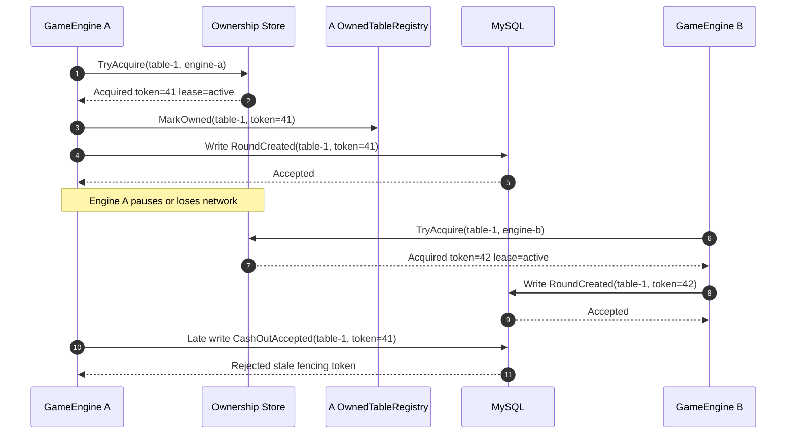
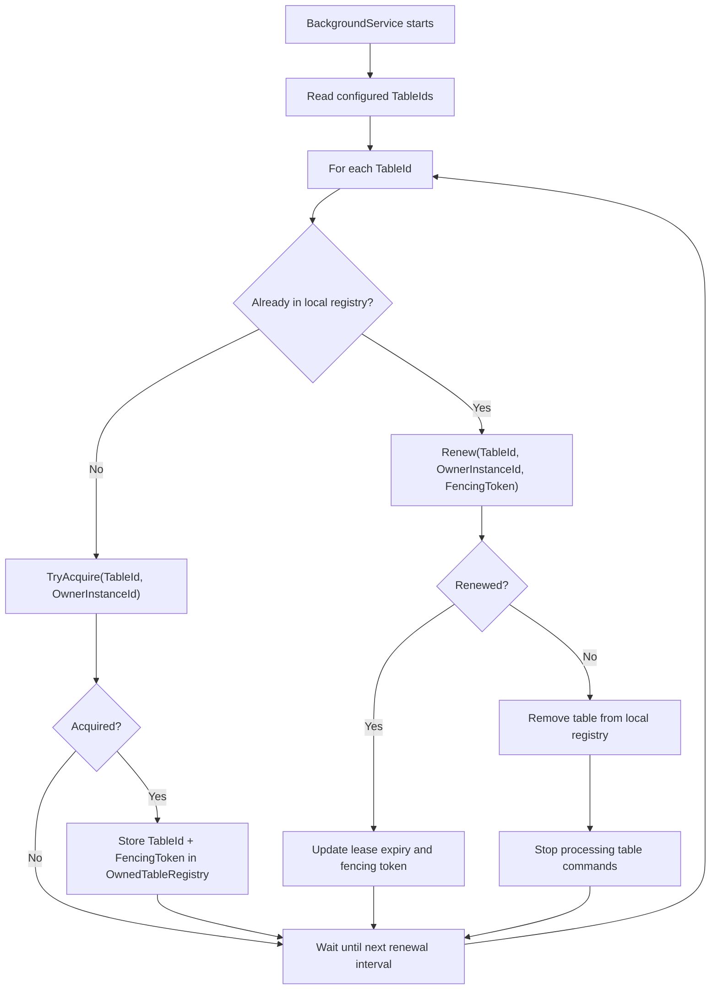
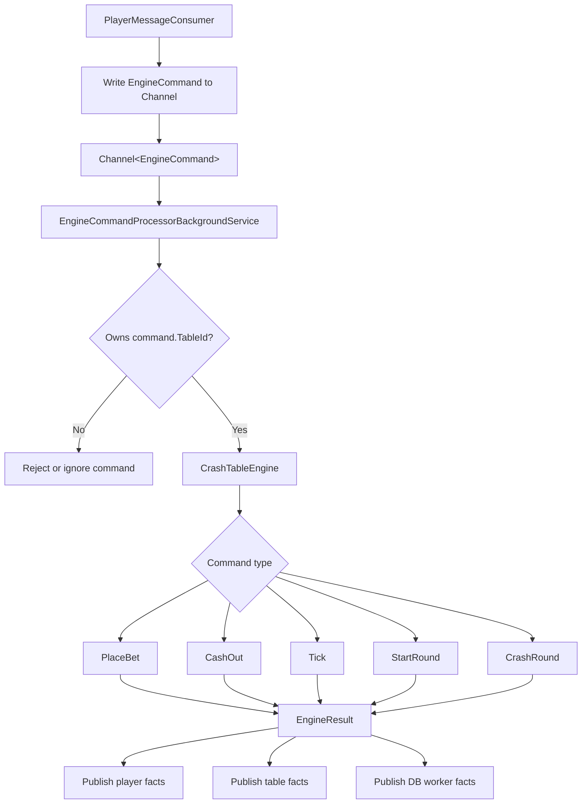
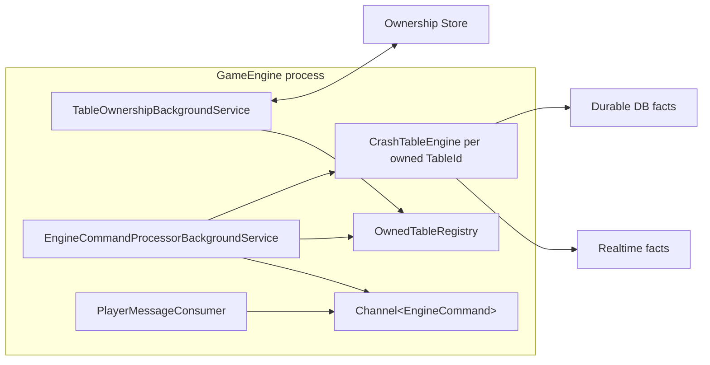
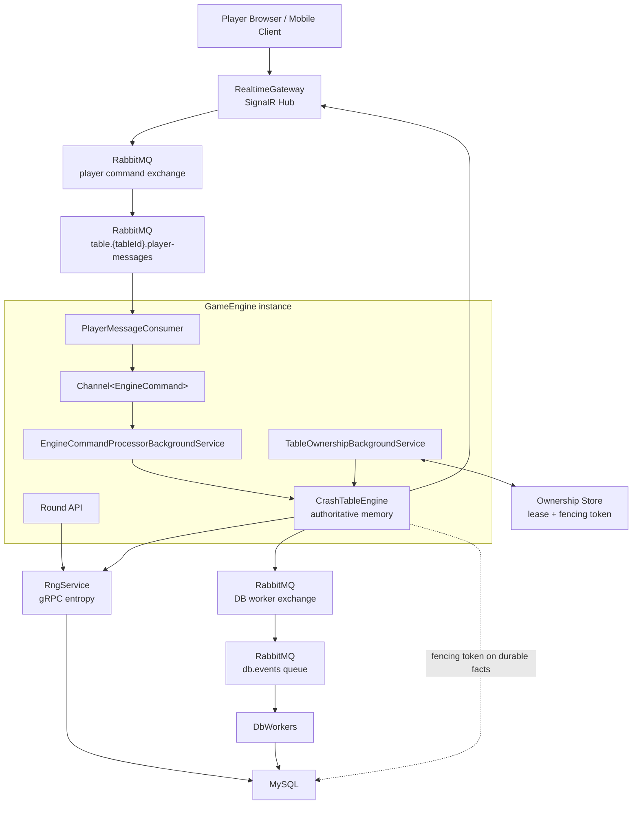

# CrashPlatform

Production-shaped backend for a generic Crash game in an iGaming environment.

The design goal is an authoritative in-memory game engine per table, with durable
messaging around it. Player decisions such as bet acceptance and cash-out are
made by the table engine first, then realtime and database messages are emitted
as facts after the state transition.

## Services

- `RngService`: gRPC service that generates round entropy, calculates a crash point, and stores the RNG result in MySQL.
- `GameEngine`: authoritative table engine process. It starts rounds, consumes player commands, owns in-memory table state, and publishes durable/realtime facts.
- `RealtimeGateway`: SignalR gateway that authenticates player connections with JWT and forwards player commands to RabbitMQ.
- `DbWorkers`: background worker service that consumes durable game facts and persists settlement/history changes.
- `rabbitmq`: durable broker for player commands and DB worker events.
- `mysql`: local MySQL database for RNG, table, round, bet, and settlement persistence.

## Game Engine Direction

The production engine is split into two hosted background services.

### 1. Table ownership service

This service owns table leases and fencing tokens.

Responsibilities:

- acquire configured `TableId` ownership on startup
- renew ownership before the lease expires
- keep the latest fencing token in memory
- remove a table from the local registry if renewal fails
- release ownership during shutdown when possible

The engine must not process commands for a table it does not currently own.
The fencing token is attached to dangerous durable writes so stale owners cannot
overwrite state after failover.

Fencing token lifecycle:



The database or durable write boundary must compare the incoming fencing token
against the latest accepted token for the table. A stale engine may still be
alive, but its writes are rejected because its token is older.

Table acquisition and renewal:



Pseudo shape:

```csharp
public sealed class TableOwnershipBackgroundService : BackgroundService
{
    protected override async Task ExecuteAsync(CancellationToken stoppingToken)
    {
        while (!stoppingToken.IsCancellationRequested)
        {
            foreach (var tableId in options.TableIds)
            {
                if (!ownedTables.TryGet(tableId, out var ownership))
                {
                    var acquired = await ownershipStore.TryAcquireAsync(tableId, ownerInstanceId, stoppingToken);

                    if (acquired is not null)
                    {
                        ownedTables.MarkOwned(acquired);
                    }

                    continue;
                }

                var renewed = await ownershipStore.RenewAsync(
                    ownership.TableId,
                    ownerInstanceId,
                    ownership.FencingToken,
                    stoppingToken);

                if (renewed is null)
                {
                    ownedTables.Remove(ownership.TableId);
                    continue;
                }

                ownedTables.MarkOwned(renewed);
            }

            await Task.Delay(TimeSpan.FromSeconds(2), stoppingToken);
        }
    }
}
```

### 2. Engine command processor

This service owns the command loop. Player commands are written into a
`Channel<EngineCommand>`, then processed sequentially by the authoritative table
engine.

For learning, this can be an `UnboundedChannel<>`. For production, prefer a
`BoundedChannel<>` with clear rejection/backpressure behavior.

Responsibilities:

- read player commands from the channel
- verify the process still owns the command's `TableId`
- dispatch to the correct in-memory `CrashTableEngine`
- mutate memory before publishing any external message
- publish player/table realtime facts
- publish durable DB worker facts

Command processor flow:



Pseudo shape:

```csharp
public sealed class EngineCommandProcessorBackgroundService : BackgroundService
{
    protected override async Task ExecuteAsync(CancellationToken stoppingToken)
    {
        await foreach (var command in commandChannel.Reader.ReadAllAsync(stoppingToken))
        {
            if (!ownedTables.TryGet(command.TableId, out var ownership))
            {
                continue;
            }

            var tableEngine = tableEngines.GetOrCreate(command.TableId);

            var result = command.Type switch
            {
                EngineCommandType.PlaceBet => tableEngine.PlaceBet(command, ownership.FencingToken),
                EngineCommandType.CashOut => tableEngine.CashOut(command, ownership.FencingToken),
                EngineCommandType.Tick => tableEngine.Tick(command, ownership.FencingToken),
                EngineCommandType.StartRound => tableEngine.StartRound(command, ownership.FencingToken),
                EngineCommandType.CrashRound => tableEngine.CrashRound(command, ownership.FencingToken),
                _ => throw new InvalidOperationException("Unknown engine command.")
            };

            foreach (var message in result.PlayerMessages)
            {
                await realtimePublisher.PublishToPlayerAsync(message, stoppingToken);
            }

            foreach (var message in result.TableMessages)
            {
                await realtimePublisher.PublishToTableAsync(message, stoppingToken);
            }

            foreach (var dbEvent in result.DbEvents)
            {
                await dbPublisher.PublishAsync(dbEvent, stoppingToken);
            }
        }
    }
}
```

## Message Flow

```text
Player client
  -> SignalR RealtimeGateway
  -> RabbitMQ table queue
  -> GameEngine player message consumer
  -> Channel<EngineCommand>
  -> authoritative CrashTableEngine
  -> realtime facts to players
  -> durable facts to DbWorkers
```

Inbound player commands:

- `PlaceBet`
- `CashOut`
- `UpdateAutoCashOut`
- `JoinTable`
- `LeaveTable`
- `ReconnectSnapshot`

Outbound realtime facts:

- `BettingOpen`
- `BetAccepted`
- `BetRejected`
- `RoundStarted`
- `RoundTick`
- `CashOutAccepted`
- `CashOutRejected`
- `RoundCrashed`
- `RoundSettled`
- `TableSnapshot`

Durable DB worker facts:

- `RoundCreated`
- `BetPlaced`
- `BetRejected`
- `CashOutAccepted`
- `CashOutRejected`
- `RoundCrashed`
- `RoundSettled`

`TableId` must be present on commands, rounds, bets, snapshots, durable events,
and realtime messages. It is the partition and ownership boundary.

## Background Services



`TableOwnershipBackgroundService` controls whether the process is allowed to run
a table. `EngineCommandProcessorBackgroundService` controls the ordered command
execution for tables that are currently owned.

## Run

```bash
docker compose up --build
```

Start one round:

```bash
curl -X POST http://localhost:5002/rounds/start \
  -H "Content-Type: application/json" \
  -d '{"tableId":"table-1","roundId":"round-1","clientSeed":"player-seed-1","nonce":0}'
```

Submitting the same `tableId` and `roundId` again returns the stored RNG result instead of creating a second result.

## Realtime Player Messages

Connect clients to the SignalR hub at:

```text
http://localhost:5003/hubs/player
```

The bundled browser client is served by Docker at:

```text
http://client.dev
```

For local development, add this host mapping once:

```text
127.0.0.1 client.dev
```

The connection must include a JWT in `access_token` or `Authorization: Bearer <token>`. For local development the signing key is:

```text
local-dev-signalr-jwt-signing-key-change-me
```

The JWT payload must include:

```json
{
  "table_id": "table-1",
  "player_id": "player-1",
  "exp": 4102444800
}
```

Send player actions through the `SendMessage` hub method:

```json
{
  "type": "bet",
  "amount": 10,
  "currency": "USD",
  "autoCashOut": 2
}
```

`RealtimeGateway` publishes the message to RabbitMQ with the table id as the routing key and ensures a durable table queue exists. Each `GameEngine` instance consumes only the table queues configured in `GameEngine:TableIds`.

The next step is to route consumed messages into `Channel<EngineCommand>` instead of only logging them.

## Current Scope

Implemented:

- RNG entropy generation over gRPC
- round start endpoint in `GameEngine`
- SignalR gateway authentication
- player command publishing to table-routed RabbitMQ queues
- game engine consumption from configured table queues
- DB worker service skeleton

In progress / next:

- table ownership background service
- fencing-token renewal and stale-owner protection
- channel-backed engine command processor
- authoritative in-memory bet and cash-out handling
- realtime fanout for table/player facts
- durable business facts for DB workers
- wallet settlement flow

## Infrastructure Diagram


